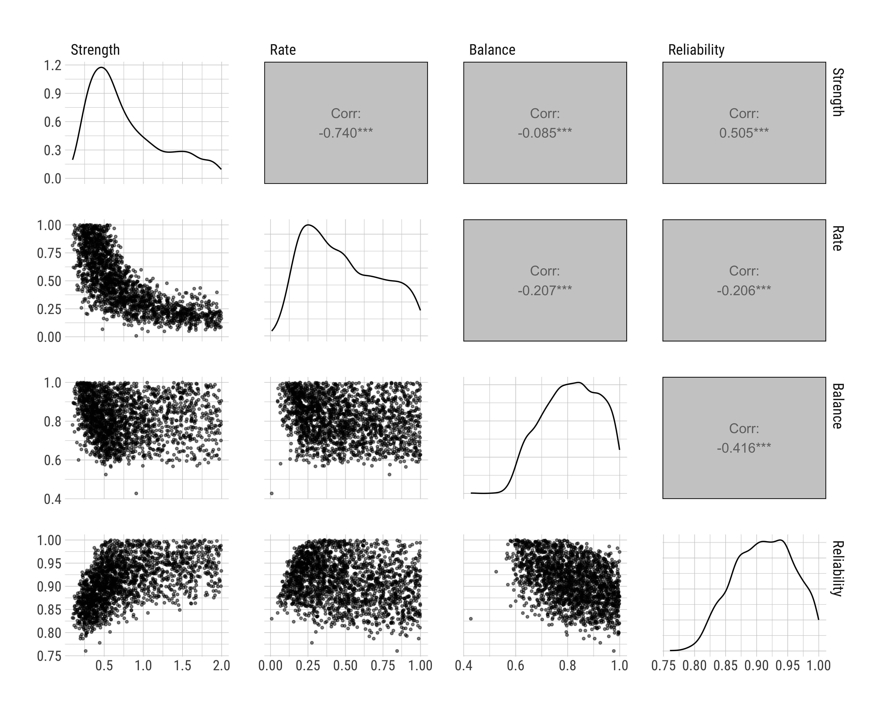
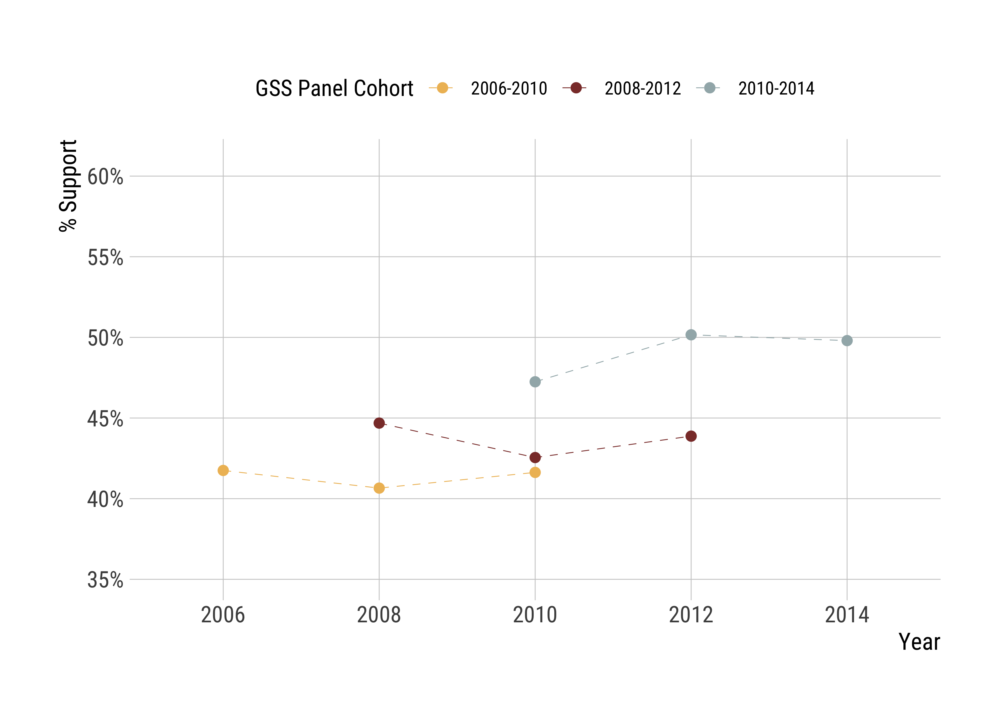
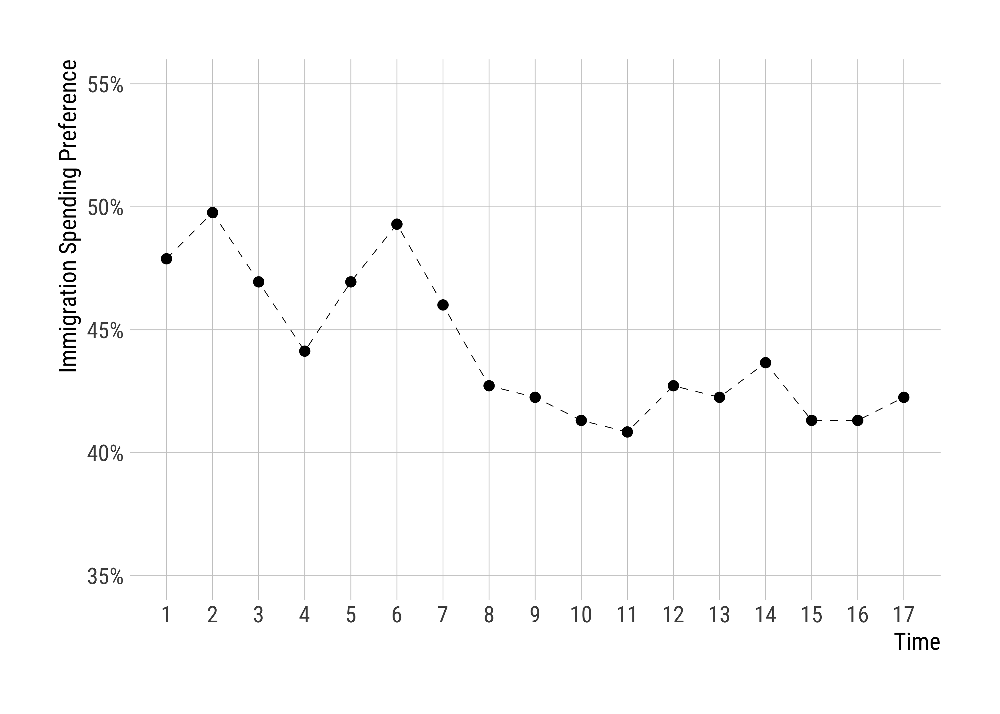

```{r setup, include=FALSE}
library(tidyverse); library(knitr); library(kableExtra)
knitr::opts_chunk$set(echo = F, 
                      message = F, 
                      warning = F)
knitr::opts_chunk$set(fig.align = "center")
```

Studies on political change at the individual level---change in one's attitudes, values, or preferences---face a challenging problem: while our methods typically provide estimates for change and stability at the group level, our goal is often to understand these processes at the individual level.

This *group-to-person generalizability problem*, the claim that group-level findings may not generalize to each person [@mcmanus2023], has important implications for what we can and can't say about political change across the life-course. While the previous research quantified change with various methods---ranging from assessing the time order of longitudinal observations [@kiley2020; @vaisey2020] to multilevel decomposition of over-time variance [@lersch2023]---these studies have fallen short of disentangling whether they find a small amount of change in a large number of people, or a large amount of change in a small number of people.

This issue arises in a variety of ways in empirical practice, particularly when we want to theorize the mechanisms of political belief change. For example, the General Social Survey (GSS) shows that roughly 35% of the American adults in 2006 believed that "marijuana should be legalized." In less than 10 years, this support had increased to nearly 60%. As seen in Figure 1, this change occurred both *cross-sectionally*, where average support increased with time, and *longitudinally*, where at least some segments of the American population changed their minds on this policy.

```{=latex}
\begin{figure}[!ht]
\begin{center}
```
```{r figure1, out.width = "100%"}
knitr::include_graphics("../figures/grass01.png")
```
```{=latex}
\end{center}
\caption*{Figure 1: The Percent Support for Marijuana Legalization}
\footnotesize{\textit{Notes:} The figure depicts the percent of American adults saying "marijuana should be made legal" in the General Social Survey 2006, 2008, and 2010 panel studies. We included respondents who participated in all three waves of each panel study and weighted the results using GSS post-stratification weights. Note that panel attrition caused compositional changes in the estimates, and compared to the GSS time-series data, the estimates of support are marginally inflated.}
\end{figure}
```

However, these two processes, cross-sectional change and longitudinal change, attract competing theories of political change, and group-level estimates may not properly adjudicate the underlying generative mechanisms. Following the same example, the cross-sectional change in beliefs about marijuana legalization may have occurred via two mechanisms: people may have changed their minds following a changing _zeitgeist_, or old generations who disapproved this policy might have been replaced by new generations approving it. Similarly, the longitudinal change could result from various mechanisms: large segments of the population may have shifted their opinions positively in small amounts, a small segment of the population may have made large changes, or a mix of changes---including both approvals and disapprovals---may have altered the overall balance.

While the cross-sectional processes received strong scholarly attention in the literature [@vaisey2016; @restrepoochoa2024; @bartels2014], questions of the second sort remained largely unexplored. However, given that theories of political ideology involve theoretical expectations about individual-level outcomes, the fact that we lack information about whether our models capture person-level empirical processes is detrimental to understanding adult belief change in the political context. Therefore, our article aims to address this gap by examining whether we can identify (a) *how many people changed*, (b) *how much they changed*, and (c) *who changed*, based on observed survey response trajectories of political beliefs in empirical data.

Using simulations and empirical case studies, we show that it is indeed possible to provide plausible scenarios as to which generative models are more likely to have produced empirical observations, even though a reliable identification of *who* changed occurs only under very narrow conditions. In doing this, we provide a simple grid-search procedure to aid researchers in evaluating the extent to which their target estimates may be generalized to the population of their study. We explore how competing generative models can lead to varying assumptions, emphasizing the importance for researchers to carefully consider the conditions under which claims about personal-level change can be made. Accordingly, we claim that when the meaning of "political change" is elusive and depends too much on how we define change in the first place, our empirical strategies could potentially mislead rather than inform, especially if we overlook the underlying generative mechanisms.

We start with an overview of the "latent variable model" of beliefs and the problems of reliability and resolution in survey response measurement [@alwin2007]. We then introduce our grid-search procedure in the context of three-wave panel data with binary outcomes, examining cases from the GSS on marijuana legalization and abortion. In the next section, we relax the period assumption and investigate how linear trajectories at the individual level can assist us in understanding underlying generative mechanisms in contexts with more than three waves. In the final empirical section, we analyze whether these generative models help us in classification tasks. We conclude by discussing the promises and pitfalls of panel data for understanding individual belief change.

# Measuring Change in Political Beliefs

Alwin's [-@alwin2007] latent-variable approach to survey response is based on the assumption that there is a random variable $Y$, which captures a person $i$'s "true" position in a continuous latent construct. This random variable might stand in for any disposition, including one's political attitudes, values, and preferences, which allows us to define one's political position---at the level of one's "personal culture" [@lizardo2017]---as their *true score* $Y_i$.[^1]

[^1]: Naturally, the assumption that *there is indeed a true score* might miss cases where individuals hold contradictory ideas [@swidler1986] and are ambivalent about their true positions [@zaller1992; @zaller1992a]. In this article, we follow the latent variable model and assume that there *is* a true position for each individual.

The latent-variable approach reveals a fundamental problem in survey research: one's true score $Y_i$ is almost always realized with a certain degree of measurement error. Call this realization the *observed score* $y_i$. We often assume that $y_i$ represents the expected value of hypothetical draws from $Y_i$, with an $\epsilon$ term reflecting the measurement error in this process---i.e., $y_i = Y_i + \epsilon_i$. This error might result from various factors that introduce biases to how we extract information from individuals, given that problems like question construction and interviewer effects might contaminate how individuals reveal their true preferences [@alwin1991]. The inherent stochasticity in this measurement process implies that each draw from $Y_i$ might at least slightly differ from the true score, and this error term is difficult to circumvent with one measure, which is often the case in public opinion surveys.[^2] In this sense, there is often a degree of systematic gap between $Y_i$ and $y_i$.

[^2]: The idea that we should have repeated measures of $Y_i$ is the main intuition behind scale construction [@ansolabehere2008], with the explicit expectation that multiple measures can help us reduce measurement error.

Hence, the main problem is mapping one's true scores to their observed scores, and there are at least two ways we can fail in this context. First, our observed measures might have low *reliability*, such that a hypothetical set of repeated draws may significantly differ from one's true score, due to, e.g., poor question construction or individual idiosyncrasies. Second, survey response categories may be imperfect: the *resolution* of response categories may fail to distinguish consequential differences in people's true scores. In either case, the observed score may not reliably indicate one's true score.

## Separating True Change and Measurement Error in Panel Data

In the panel context, where we observe the same individuals across time, the measurement problem causes substantive questions: if true scores are imperfectly realized and we only have access to one's observed responses, how can we know if a person *actually changed* between time $t$ and $t + 1$, or whether the observed change is merely due to measurement error?

Scholars in public opinion research have attempted to address this issue in multiple ways, using structural equation models that explicitly quantify the measurement error component [@achen1975], strategies that integrate longitudinal surveys to exploit the information in the ordering of responses [@kiley2020], and various multilevel mixed-effects models that shrink responses based on population estimates to derive reliable trends [@lersch2023; @hout2016]. To some extent, all these strategies were fruitful to offset the problems associated with measurement error.[^3] That said, while these empirical strategies were largely successful in accounting for the amount of change *in the population*, they were rather silent about *who* changed in our observations.

[^3]: However, note that the use of repeated observations in the panel context comes with additional assumptions: it is rather straightforward to assume that multiple measures at time $t$ can be indicative of an underlying construct---e.g., we can average them to have an index---but the use of different time periods needs a *stability* assumption, that is, the reliability estimates may only be computed if one assumes that people do not really change between waves, which might confuse true change with measurement error [see, e.g., @hout2016].

Why is this important? After all, if we can produce reasonable estimates at the population level, this must surely be enough. We believe that there are at least two reasons why we should care about this problem. First, the inability to identify the individuals who truly change gives us a false sense of homogeneity. When we report an average change of, say, 0.10 standard deviations, we do not know whether this reflects uniform change in latent positions across all individuals, or significant changes in some while others remain stable. This is a big substantive difference, yet often overlooked in practice. Second, if we cannot identify the "changers" in the first place, our comparisons between groups---either across some pre-determined characteristic, or across treatment status---will average true processes with false negatives and false positives. This is obviously fine if the error occurs randomly, but it is challenging to verify this if individual-level accuracy is compromised. Hence, glossing over this problem discourages us to think about what exactly we are averaging.

## The Question of Individual Belief Change

We can now clearly state our research question: given a longitudinal panel study where we observe some individuals across time, how can we determine the underlying generative process---that is, how many people changed, how much their latent positions changed, and who changed---given a level of latent score reliability, response resolution, and a longitudinal survey design?

We pose these questions in a fixed-effects panel context [@allison2009; @vaisey2017], with varying individual trajectories across time [@rüttenauer2020]. This achieves two things. First, it allows us to shift the focus from *distributional change* to *individual change*, given that our theoretical interest is to understand how people change their political beliefs over the life-course. Second, it allows us to model response trajectories, rather than individual changes in response to a shock. Instead, our focus is "classification"---the extent to which we can discriminate those who change from those who do not change in a specific time window.

## A Grid-Search Procedure for Identifying Individual Belief Change

We propose a grid-search procedure to answer our research questions. The idea is straightforward:

(1) Generate simulated datasets with several parameters of interest---rate of change, strength of change, and the direction of change, so that we know the real data-generation process (DGP);
(2) Calculate the distribution of response trajectories in both the observed and simulated data;
(3) Compare the simulated trajectories to the observed trajectories, calculating a distance measure to quantify the extent to which specific simulated values reproduce the observed values;
(4) Replicate this analysis $N$ times for all possible parameter combinations;
(5) Inspect the parameter combinations that most closely approximate to the observed values.

This is simply what Gelman and Hill [-@gelman2007] call a "fake-data simulation," and it is powerful for at least two reasons. First, it allows us to produce reasonable estimates as to what plausible generative models might have produced the real data, ensuring that we can make educated guesses about the extent to which our parameter estimates might generalize to our populations. Second, it is generative, meaning that we can ask specific questions about response trajectories and modeling assumptions.

Our fake-data simulations involve several DGP components: a random variable $Y_{it}$ for true scores, with varying realizations $y_{it}$, representing a person $i$'s beliefs at time $t$; an indicator for change, $D_{it}$, operationalized as a non-reversible trigger if there is a respondent-level switch in true scores; an effect size, $\delta$, and a respondent level direction multiplier $\tau_i$ that indexes whether the change occurs in a positive or a negative direction. Using these components, the DGP follows

$$
y_{it} = Y_i + \delta \tau_i D_{it} + \epsilon_{it} \ \text{ with } \epsilon_{it} \sim \mathcal{N}(0, 1) \tag{DGP}
$$

Note that we allow actors to go through change at any time in the observation window of the study, meaning that $D_{it}$ indexes an actor's change status in their biographical history.

Since our research interest concerns individual trajectories of change, we specify three parameters for these DGPs: (1) *rate of change* refers to the proportion of our sample that goes through change in their political orientations, (2) *strength of change* refers to the standardized mean change in the true score when someone changes---described as Cohen's $d$---and (3) *direction of change* refers to the proportion of changers who change in positive and negative directions. The combination of these three parameters provides a complete picture of population movement in political beliefs.[^4]

[^4]: We define additional parameters that we fix in the case studies presented below: $N$ refers to the number of actors in the fake-data simulation, $T$ refers to the number of waves we have in the panel study, *balance* refers to the observed marginals in the real datasets, *reliability* refers to the item-reliability score regulating the extent to which a true score is realized in the survey context with given level of item reliability [@alwin2007], and *resolution* refers to the number of categories to simplify the latent variable, which is restricted to the binary case in this article.

Using these parameters, we can construct various generative models and compare the simulated trajectories to the observed trajectories to examine how closely certain parameter combinations approximate our empirical observations. In the next three sections, we will apply this procedure in different contexts. In all cases, we restrict our attention to latent variables with binary outcomes to simplify our analyses, but all results are generalizable to cases with higher resolution.[^repo]

[^repo]: The replication files for the article are stored in https://github.com/tkeskinturk/simulating_change

# Study 1: Three-Wave Panel Context

In the three-wave panel context with binary outcomes, the response trajectories are easy to inspect, given that there are only $2^3 = 8$ possible response patterns for each person:

$$
\bigg( \{0,0,0\}, \{0,0,1\}, \{0,1,0\}, \{0,1,1\}, \{1,0,0\}, \{1,0,1\}, \{1,1,0\}, \{1,1,1\} \bigg)
$$

To examine the distribution of these trajectories in the observed data, we can count the number of respondents who go through trajectory $j$. For instance, the marijuana legalization example from Figure 1 has the following contingency table of counts:

$$
\begin{bmatrix}
0, 0, 0 \\
0, 0, 1 \\
0, 1, 0 \\
0, 1, 1 \\
1, 0, 0 \\
1, 0, 1 \\
1, 1, 0 \\
1, 1, 1
\end{bmatrix} 
=
\begin{bmatrix}
869 \\
153 \\
75 \\
115 \\
65 \\
71 \\
54 \\
746 \\
\end{bmatrix}
$$

Approximately 75% of the respondents remain stable, following trajectories of $\{0,0,0\}$ and $\{1,1,1\}$, while others appear to *change* in some respect. The question is the extent to which this contingency table can be approximated by an underlying generative model, where we know the true change parameters.

Let us provide one such example. We simulate a panel dataset, with 20% of the respondents changing their beliefs on marijuana legalization, operationalized as a latent construct with $\mu = 0$ and $\sigma = 1$, by 2 standard deviations in the "negative" direction---note that this is the opposite of the mean pattern observed in Figure 1. We fix all the parameters in the DGP to their observed values: 2,148 individuals observed over 3 periods, with a reliability score of 0.91 [see @hout2016 for the calculation of this value]. We know that the marginals were equal to 0.47 in the entire panel, so we constrain the binary outcomes such that the final distribution of $y$ equals to 0.47 as well. Here are the generated counts for all trajectories, with differences from the original data appended:

$$
\begin{bmatrix}
\\
0, 0, 0 \\
0, 0, 1 \\
0, 1, 0 \\
0, 1, 1 \\
1, 0, 0 \\
1, 0, 1 \\
1, 1, 0 \\
1, 1, 1
\end{bmatrix} 
=
\begin{bmatrix}
\text{Observed} \\
869 \\
153 \\
75 \\
115 \\
65 \\
71 \\
54 \\
746 \\
\end{bmatrix}
-
\begin{bmatrix}
\text{Simulated} \\
810 \\
75 \\
103 \\
57 \\
188 \\
66 \\
148 \\
701 \\
\end{bmatrix}
=
\begin{bmatrix}
\text{Absolute Difference} \\
59 \\
78 \\
28 \\
58 \\
123 \\
5 \\
94 \\
45 \\
\end{bmatrix}
$$

The generative model does a pretty poor job of reproducing the contingency table. 23% of the respondents ($N = 490$) are assigned to the wrong trajectory. This means that we should be able to improve our predictions significantly if we switch to the true data generation model. Unfortunately, we don't know it; the set of true change parameters is the exact thing we want to derive using observed trajectories.

How can we improve our prediction accuracy? Our grid-search procedure allows us to estimate plausible approximation values across a grid of potential generative models. Let us now apply this procedure to the case of marijuana legalization to see whether we can retrieve plausible DGPs.

## The Case of Marijuana Legalization

We first define 2,100 potential generative models using a combination of (1) rate of change, where we vary values from 0 to 1 in increments of 0.05, (2) strength of change, where we vary values from 0 to 2 in increments of 0.1, and (3) five directional possibilities---all negative, all positive, half negative and half positive, 75% negative and 25% positive, and 75% positive and 25% negative. This results in $21 \times 20 \times 5 =$ 2,100 cells, each representing one potential data-generation process that might have produced the observed data. We then generate corresponding panel datasets based on each model. Due to the stochastic nature of our fake-data simulations, we repeat this procedure 1,000 times for each cell, resulting in 2,100,000 datasets for which we evaluate the observed trajectories.

Once we have our fake-data simulations, we count the number of respondents assigned to each response trajectory, calculate the absolute errors relative to the observed data, and normalize these counts by dividing the error by the total number of respondents. We then average these percent errors across 1,000 simulations to obtain stable estimates. Figure 2 presents the results.

```{=latex}
\begin{figure}[!ht]
\begin{center}
```
```{r figure2, out.width = "100%"}

```
```{=latex}
\end{center}
\caption*{Figure 2: Fake-Data Simulations for Marijuana Legalization}
\footnotesize{\textit{Notes:} The figure depicts the extent to which specific parameter combinations approximate the observed data. Each point represents our distance measure, calculated as the sum of absolute errors between observed and simulated contingency tables, where darker colors represent smaller distances. We used 5\%, 10\%, and 20\% distance cuts for color shades, along with a second filter using quantiles of 0.05, 0.10, and 0.20 at each level. The shading thus reflects both absolute and relative accuracy among the simulations. The single yellow point represents the parameter combination that best approximates the observed data in the General Social Survey.}
\end{figure}
```

There are several notable findings. First, error values range from 4.6% to 69.6%, with an interquartile range of 10.6% and 24%. This indicates that many cases fail to achieve a reasonable approximation, but we still end up with reliably close generative models. Second, the best value occurs when the rate of change equals to 25%, with a positive strength of 0.9 standard deviation change (SD). That said, note the black values clustered around the yellow cell in the bottom right panel, where cells range from 25% to 35% rate of change, with strength ranging, once again, from 0.7 to 1 SD. These patterns suggest that the most plausible data generation process occurs when roughly 2 to 4 out of 10 people positively change their approvals by roughly 1 SD. Finally, as expected, there are no plausible estimates where change occurs in the negative direction, providing a plausibility check for our proposed method.

These findings demonstrate the utility of our approach. By iterating over DGPs, we can identify plausible values that may have produced the observed change trajectories in the panel context.

## The Case of the Legality of Abortion

What about cases where the direction or even existence of change is less clear-cut? We now turn our attention to the legality of abortion debate, a contentious issue characterized by high disagreement and high political sorting in the American context [@baldassarri2008; @hout2022]. In 2006, 2008, and 2010 GSS panels, respondents agreed or disagreed with the statement: "it should be possible for a pregnant woman to obtain a legal abortion if the woman wants it for any reason." Figure 3 shows response trajectories for this question across three panels, indicating a clear stasis in the marginals.

```{=latex}
\begin{figure}[!ht]
\begin{center}
```
```{r figure3, out.width = "100%"}

```
```{=latex}
\end{center}
\caption*{Figure 3: The Percent Support for Abortion}
\footnotesize{\textit{Notes:} The figure depicts the percent of American adults saying "it should be possible for a pregnant woman to obtain a legal abortion if the woman wants it for any reason" in the General Social Survey 2006, 2008, and 2010 panel studies. We included respondents who participated in all three waves of each panel study and weighted the results using GSS post-stratification weights. Note that panel attrition caused compositional changes in the estimates, and compared to the GSS time-series data, the estimates of support are marginally inflated.}
\end{figure}
```

However, the contingency table for trajectories shows more heterogeneity. Again, there is considerable stability---approximately 73% of respondents remain stable, following trajectories of $\{0,0,0\}$ and $\{1,1,1\}$, similar to the case of marijuana legalization. But there is more homogeneity in terms of directional change: while trajectories like $\{0,0,1\}$ and $\{0,1,1\}$, cases indicating an upward trend, were 2.27 times more likely in the marijuana legalization case, we now observe similar numbers in the abortion case---230 clear upward trends and 209 clear downward trends. This suggests that the directional heterogeneity of political change might have cancelled the trends in the aggregate, resulting in stable marginals in the observed frequencies.

$$
\begin{bmatrix}
0, 0, 0 \\
0, 0, 1 \\
0, 1, 0 \\
0, 1, 1 \\
1, 0, 0 \\
1, 0, 1 \\
1, 1, 0 \\
1, 1, 1
\end{bmatrix} 
=
\begin{bmatrix}
972 \\
115 \\
101 \\
115 \\
118 \\
99 \\
91 \\
733 \\
\end{bmatrix}
$$

Figure 4 presents the results from our grid-search exercise, implemented across 2,100,000 datasets with 2,100 generative models. We set the reliability to .86 following @hout2016. This time, the estimates are much closer to the observed frequencies, with error values ranging from 3% to 64.5%, and an interquartile range of 5.1% and 23.5%. That said, there is strong variability in the plausible generative scenarios. Note how, in the top right corner, there is a plausibility bound ranging from a rate of change as low as 10% to as high as 100%, and strength of change ranging from as low as 0.3 SD to as high as 2 SD, indicating a variety of scenarios. In fact, the top 10 generative models out of 2,100 DGPs have error rates within a margin of 0.04%, meaning that it is difficult to distinguish the predictive abilities of these models.

```{=latex}
\begin{figure}[!ht]
\begin{center}
```
```{r figure4, out.width = "100%"}
knitr::include_graphics("../figures/abany02.png")
```
```{=latex}
\end{center}
\caption*{Figure 4: Fake-Data Simulations for Abortion}
\footnotesize{\textit{Notes:} The figure depicts the extent to which specific parameter combinations approximate the observed data. Each point represents our distance measure, calculated as the sum of absolute errors between observed and simulated contingency tables, where darker colors represent smaller distances. We used 5\%, 10\%, and 20\% distance cuts for color shades, along with a second filter using quantiles of 0.05, 0.10, and 0.20 at each level. The shading thus reflects both absolute and relative accuracy among the simulations. The single yellow point represents the parameter combination that best approximates the observed data in the General Social Survey.}
\end{figure}
```

This exercise is an appropriate illustration of the limitations of panel studies. Based on the observed data, we cannot determine whether the observed marginals result from a small number of people making substantial belief changes or a large number of people making minor political changes. This, ultimately, boils down to the issue of observation frequency: with three-wave panel data and reasonable doubts about the accuracy of every single survey response due to reliability and resolution concerns, it is challenging to adjudicate the underlying generative models. In the next section, we relax this assumption and extend our method to cases with more than three waves.

# Study 2: Longer Panels and Linear Trajectories

Once we relax the three-wave assumption, the immediate problem is that the contingency tables will be sparse and unwieldy. Think, for instance, a panel study with 1,000 people conducted over 10 waves. Assuming binary outcomes, there are $2^{10} =$ 1,024 potential trajectories---more than the number of individuals in the study. That said, having 10 waves instead of 3 is more desirable for one simple reason: while we had to be economical in our method and count every response very seriously, we now have the opportunity to regularize a person's response trajectories, resulting in more reasonable *trends* for each individual that are less vulnerable to reliability issues.

There are multiple approaches for achieving this with panel data.[^5] We use a fixed-effects design and fit individual linear slopes of the outcome on a normalized time trajectory [@rüttenauer2020]. That is, we simply do a separate regression for each individual and use their observed slope. We apply this method to the case of immigration spending.

[^5]: Two obvious alternatives are multilevel mixed-effects models with varying intercepts and slopes [@lersch2023], which allow for shrinkage in response trajectories using partial pooling, and latent growth curve models [@proust-lima2012], which enable us to postulate latent trajectories at the individual level. Both approaches are, of course, plausible. However, the shrinkage factor in the multilevel models is far too consequential in the simulation approach when the underlying generative model has too few respondents changing, as it would place excessive emphasis on the population mean. Similarly, latent modeling with simulated grid cells results in too many researcher degrees of freedom. Therefore, we settled on the fixed effects individual model as a reasonable approach to linear trend modeling.

## The Case of Immigration Spending

The data for this exercise comes from the *Political Psychology Data from a 26-Wave Yearlong Longitudinal Study* [@brandt2021], conducted biweekly in 2019-2020 for a year. In one question in the survey, respondents were asked whether they agree with the policy of increased federal spending on immigration control. We binarized the responses to this question such that those agreeing with the statement received a 1, and those who said the spending should be decreased or kept the same received a 0. We then dropped respondents with missing data and trimmed the periods to pre-COVID windows, resulting in 213 individuals observed 17 times over 34 weeks. Although the sample for this case study is obviously not representative of any national population, it provides an intensive set of repeated observations at the individual level.

We follow the same grid-search procedure, extending our approach to cases involving linear slopes. Figure 1 provides a schematic example of our method. First, we fit linear models to the observed data, normalizing time to be between 0 and 1, and retrieve individual slopes of change. The top-left panel in Figure 1 documents the distribution of these slopes across 213 individuals. Next, we build a simulated dataset and perform the same procedure to extract individual slopes. The bottom-left panel in Figure 1 shows one such instantiation, where we build a dataset with a fixed rate of change of 25%, a strength of change of 2 SD, and a 50%--50% split in directional change, with individual slopes for 213 simulated respondents. In the final step, we compare these two distributions using a two-sample Kolmogorov-Smirnov (KS) statistic to quantify the distance between the observed data and the simulated data from one generated model. The right panel in Figure 1 documents the empirical CDFs of these two distributions, which we use in our calculations of the KS statistics.

```{=latex}
\begin{figure}[!ht]
\begin{center}
```
```{r figure5, out.width = "100%"}

```
```{=latex}
\end{center}
\caption*{Figure 5: The Distribution of Linear Trajectories}
\footnotesize{\textit{Notes:} The figure shows linear trajectories from the first 17-waves of the \textit{Political Psychology Data from a 26-Wave Yearlong Longitudinal Study} (26W), covering the pre-COVID period of the study. The top-left panel depicts the distribution of individual slopes from varying fixed effects models, where a set of respondents agreed---or not---with the statement, "federal spending to control immigration should be increased." We included respondents who participated in all 17 waves (N = 213). The bottom-left panel depicts the distribution of individual slopes from a simulated dataset, with a fixed rate of change of 25\%, a strength of change of 2 SD, and a 50\%--50\% split in directional change. The right panel shows the empirical cumulative distribution functions from each of these distributions.}
\end{figure}
```

Figure 6 presents the results for this procedure, implemented across, once again, 2,100,000 datasets with 2,100 generative models. As can be seen in the figure, there is a clear cluster of results in a specific region of the grid. KS statistics range from 4.9% to 47.6%, with an interquartile range of 11% and 18.2%. The plausibility bounds indicate that between 50% to 80% of respondents may have made a change of roughly 0.5 SD, resulting in a mean decline in support for increased immigration control spending. Consistent with our baseline expectation of a mean decline, the plausible scenarios involve true changers making their changes in a negative direction.

```{=latex}
\begin{figure}[!ht]
\begin{center}
```
```{r figure6, out.width = "100%"}
knitr::include_graphics("../figures/immigration02.png")
```
```{=latex}
\end{center}
\caption*{Figure 6: Fake-Data Simulations for Immigration}
\footnotesize{\textit{Notes:} The figure depicts the extent to which specific parameter combinations approximate the observed data. Each point represents our distance measure, calculated as the Kilmogorov-Smirnov statistics of the empirical CDFs of observed and simulated slopes, where darker colors represent smaller distances. We used 5\%, 10\%, and 20\% distance cuts for color shades, along with a second filter using quantiles of 0.05, 0.10, and 0.20 at each level. The shading thus reflects both absolute and relative accuracy among the simulations. The single yellow point represents the parameter combination that best approximates the observed data in the 26W Study.}
\end{figure}
```

With this exercise, we extended our grid-search procedure to cases with more than three waves of panel data, but the same procedure is applicable to the three-wave case as well, provided that the analyst believes it is appropriate to use linear slopes estimated from three observations. The underlying logic, however, is the same: as long as we have comparable trajectories in the simulated data relative to our observed empirical data, we can scale up the process and perform algorithmic searches.[^6]

[^6]: Of course, one such procedure may involve a lazy algorithm that goes through a targeted search, where each iteration involves more focused and narrow bands of parameters. This is vulnerable to get stuck in local optima, however.

# Study 3: Detection of True Changers

So far, we have presented simulation evidence for recovering plausible generative models (DGPs) that may have produced the observed empirical data. But what about *classifying individuals* into those who change and those who do not? Suppose that, using the grid-search procedure, we happen to determine the true generative model for our empirical observations. Can we also recover an accurate classification of changers and non-changers at the individual level? That is, given a vector of predictions, can we measure our success in identifying the true changers [@tharwat2020]?

To address this question, we conduct another simulation exercise. Similar to earlier simulations, we generate $N$ datasets, this time using parameters fixed to the best-case values identified through our grid-search procedure. In each of these datasets, we estimate linear regressions at the individual level with time scaled from 0 to 1---effectively allowing us to extract a model-predicted measure of change for each person. We use a straightforward heuristic to decide whether a simulated person changed: if the linear slope is closer to the strength-of-change parameter than it is to 0, the respondent gets classified as a *changer*, otherwise, they are classified as a *non-changer*. We then cross-tabulate these predictions with the real change indicator used during the generation of the data, constructing a "confusion matrix" that compares true change classifications with observed change classifications.

In the binary, three-wave case, these classifications are straightforward. Only the 001, 011, 100, and 110 cells can be classified as changers because only they can have non-zero slopes---in fact, all have slopes of 1 or -1. In cases where the most plausible DGP is one directional, like for the marijuana question, only two of those cells would be classified as changers. The situation is more complicated for a more continuous case, like that of immigration in the 26-wave data. Many different slopes are possible. In those cases, classifying people as closer to "changers" or "non-changers" relies on choosing a cutoff, as we do here.

In either case, this binary classification allows us to assess how "accurate" we are in a single simulation run. Of course, there are multiple ways to conceptualize accuracy, but for our purposes, we focus on two: *sensitivity* and *specificity*. The former measures the probability that a true changer will get classified as a changer; the latter is the probability that a true non-changer will be classified as a non-changer. These are the formulas for each:

$$
\begin{aligned}
\text{Sensitivity} &= \frac{\text{True Positive}}{\text{True Positive + False Negative}} & \text{Specificity} &= \frac{\text{True Negative}}{\text{True Negative + False Positive}}
\end{aligned}
$$

We extract the best-case scenarios from our three empirical case studies---marijuana legalization, the legality of abortion, and immigration spending---and perform the classification task across 1,000 fake-data simulations. We then calculate the sensitivity and specificity scores in each run.

A concrete example will help clarify what these numbers mean. The mean sensitivity for the abortion question is .205. This means that only 21% of those who actually changed would be correctly classified as changers, even with full knowledge of the data generating process. This is due to several factors, including the shortness of the panel, imperfect reliability---though .86 is quite good---and the low level of response resolution, which is binary.

For sensitivity, the number is higher at .828. This means that 83% of the non-changers are correctly classified. This is largely due to the marginal distribution of change.

The distributions of sensitivity and specificity for all three analyses are presented in Figure 7. It is clear that our general ability to identify true changers is quite low, whereas the identification of true non-changers is rather better. Across simulations, sensitivity ranges between 17% and 54%, while specificity scores range between 74% and 95%. That said, there are also subtle differences among the case studies. Sensitivity scores are consistently lower in the legality of abortion case, reflecting our earlier discussion about how the plausible set of scenarios was much higher in that case. At the same time, the spread of simulation scores is rather high in the case of immigration spending for both sensitivity and specificity, suggesting that linear trajectories in longer panels might be rather susceptible to randomness in our analyses.

```{=latex}
\begin{figure}[!ht]
\begin{center}
```
```{r figure7, out.width = "100%"}
knitr::include_graphics("../figures/detection.png")
```
```{=latex}
\end{center}
\caption*{Figure 7: Sensitivity and Specificity Across Case Studies}
\footnotesize{\textit{Notes:} The figure depicts the sensitivity---true positives divided by the sum of true positives and false positives---and specificity---true negatives divided by the sum of true negatives and false negatives---scores across three studies.}
\end{figure}
```

These results suggest that, while the grid-search procedure allows us to identify plausible generative models that may have generated the empirical patterns, detecting true change at the level of individuals occurs under only very narrow conditions. The fact that linear trends with longer panels performed better, on average, than the three-wave cases indicates that having longer panels might be essential to dampen the negative effects of response reliability on our estimates. This finding emphasizes the importance of collecting panel data over more extended periods to increase the robustness of our proposed DGPs, and the accuracy of identifying true changers in the population.

# Discussion and Conclusions

In this article, we examined the identification of belief change in panel context. Using simulations and empirical case studies, we showed that a grid-search procedure that iterates over generative models can help us identify plausible data generation processes that may have produced our empirical observations, though the identification of individual cases occurs under narrow conditions. We argued that the *group-to-person generalizability problem* is an impediment to a robust understanding of political belief change, and scholars should understand the extent to which their target estimates can generalize to the population of their study. As such, we proposed a simulation approach that takes response generation seriously, which may help us move forward in addressing this problem.

This article has several implications for the study of belief change across the life-course. First, our findings suggest that recent debates about the existence or non-existence of belief change in adult populations [@kiley2020; @lersch2023] should tackle the heterogeneous nature of change and stability in individual preferences since group-level measures may hamper our understanding of individual mechanisms. Instead, scholars need to specify the generative models that aggregate average estimates imply. Analyses that examine population patterns over time allow us to adjudicate whether compositional changes or individual changes drive cumulative political change [@bartels2014; @vaisey2016]. Similarly, we need robust and reliable panel studies to decompose whether individual changes occur across all individuals---implying period changes---or in specific groups of people---implying political heterogeneity.

Second, the ambivalence in response trajectories and the observation that linear trend models may perform better with longer panels indicate that classical solutions to the measurement problem---ranging from scale construction to structural equation models and principal component analyses [@judd1980; @ansolabehere2008; @alwin1991]---should have an important place in panel designs, as even moderate reliability scores can significantly hinder our ability to specify plausible generative processes. We highlighted that a fundamental challenge in the study of belief change is distinguishing whether an observed change is due to true change or measurement error, and reliability and resolution are of utmost importance to resolve this problem.

One theoretical assumption of this article was to rely on a latent variable model, and avoid questions about contradictory considerations in human cognition that mitigate stable and coherent opinion formation [@converse1964; @zaller1992a]. This issue, of course, introduces another layer to the problem of belief change and measurement error. We relied on a very strong assumption that an individual has a central tendency when it comes to political issues, rather than being functionally "random" in their responses to survey questions. However, a careful examination of adult belief change should be grounded in a more theoretically-sound study of belief formation.

Third, our finding that individual classifications of change status are largely ineffective means that future research needs to be more sensitive to the detection of trends in individual survey responses over time. As mentioned earlier, varying modeling strategies, ranging from multilevel mixed-effects models that rely on partial pooling to various forms of latent mixture models, could improve the reliability of responses at the individual level. We believe that the use of these modeling strategies, along with longer panel designs, could provide important corrections to the study of belief change.

Finally, these results call for granular panel surveys that go beyond the classical 2-wave and 3-wave designs, as reliability concerns significantly limit the plausible conclusions we can derive from these shorter panels. In a 2-wave setup, where there is only one change, we can never properly establish whether a change we observe is due to measurement error or it is indeed a genuine shift, making extended panel designs necessary. The differences among our case studies, along with the sensitivity and specificity tests, suggest that panel studies with shorter designs are largely not suited for trend modeling. Since we care about generative models rather than one observed sample, strategies that enable us to reliably estimate target quantities are warranted and essential to make progress on longstanding questions about belief change.

# References
