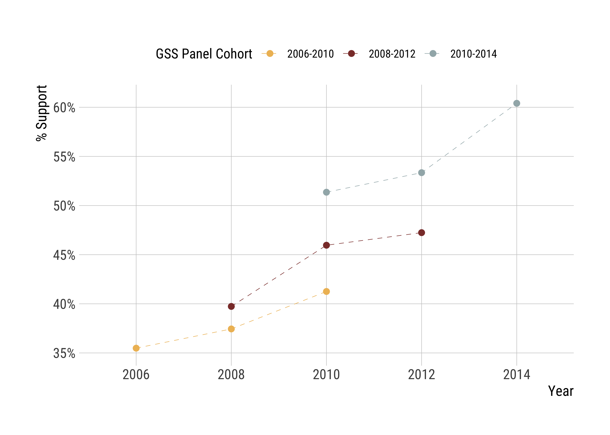
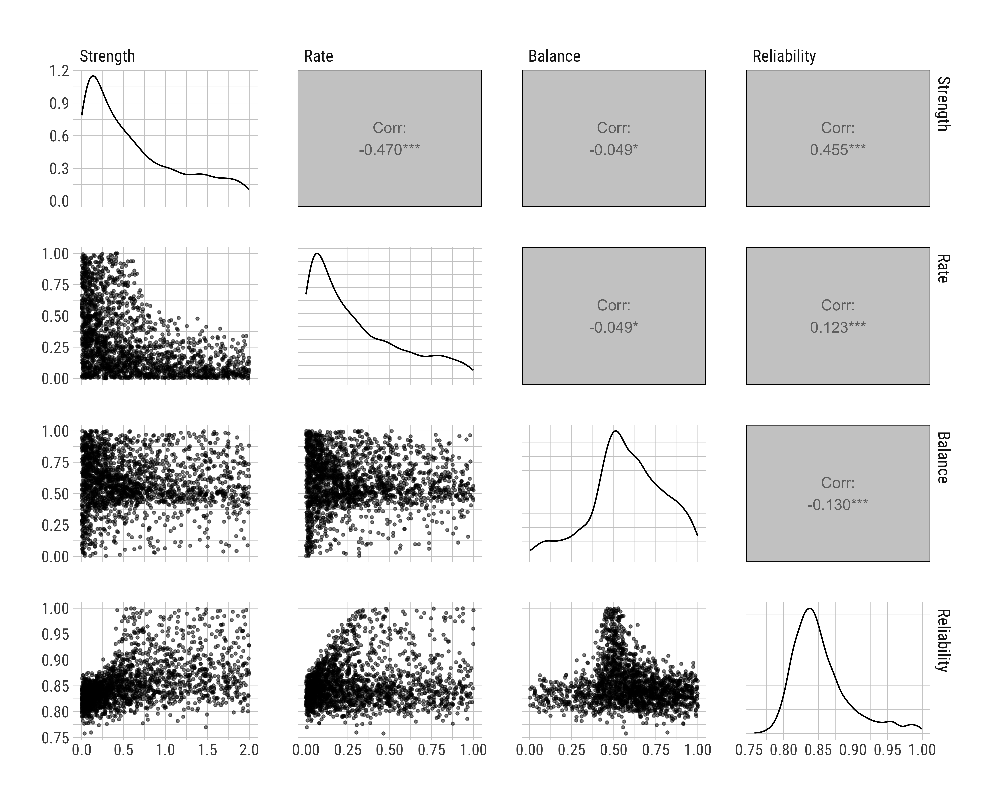
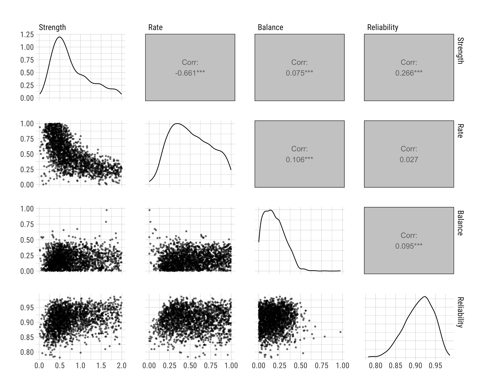
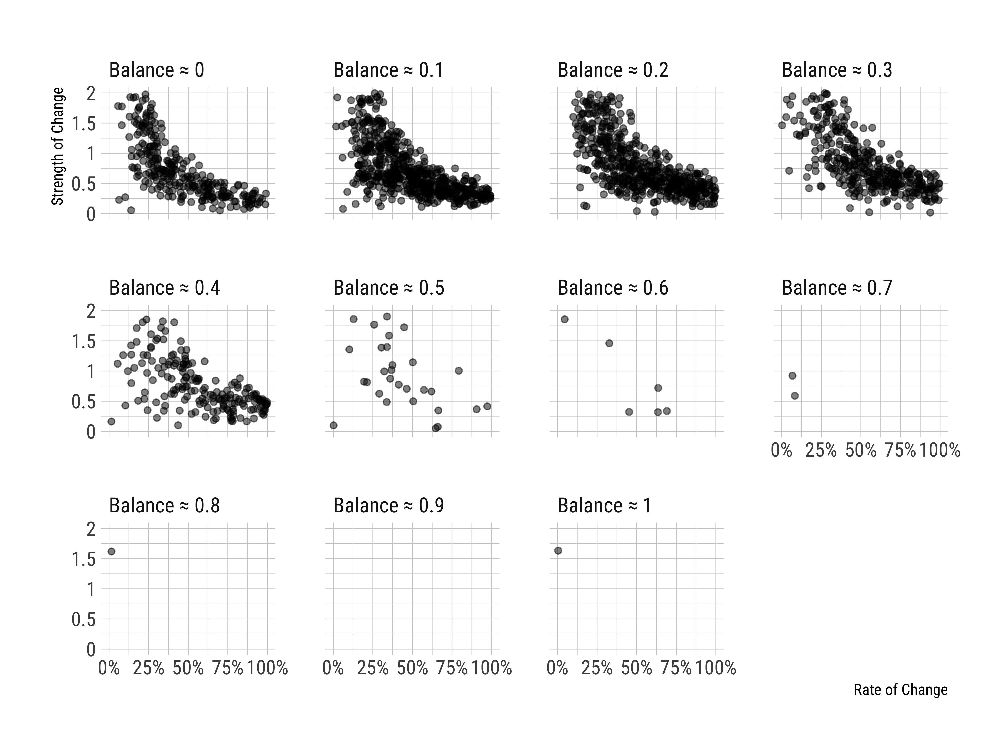

[^thanks]: We thank the participants of the *Worldview Lab at Kenan Institute for Ethics* at Duke University for their insightful and helpful comments on this project.
[^TK]: Department of Sociology, Duke University, `turgut.keskinturk@duke.edu`.
[^PB]: Department of Sociology, Duke University, `pablo.bello@duke.edu`.
[^SV]: Department of Sociology and Political Science, Duke University, `stephen.vaisey@duke.edu`.

```{r setup, include=FALSE}
library(tidyverse); library(knitr); library(kableExtra)
knitr::opts_chunk$set(echo = F, 
                      message = F, 
                      warning = F)
knitr::opts_chunk$set(fig.align = "center")
```

Studies on political change at the individual level---change in one's beliefs and preferences---face a challenging problem: while our methods typically provide estimates for change and stability at the population level, our goal is often to understand these processes at the individual level.

This *group-to-person generalizability problem*, the claim that group-level findings may not generalize to each person [@mcmanus2023], has important implications for what we can and can't say about political change across the life-course. While the previous research quantified change with various methods---ranging from assessing the time order of longitudinal observations [@kiley2020; @vaisey2020] to multilevel decomposition of over-time variance [@lersch2023]---these studies have been unable to disentangle whether they find a small amount of change in a large number of people, a large amount of change in a small number of people, or a mix of positive and negative trajectories. In other words, while social science researchers have become sophisticated in evaluating the average levels of change over time in a population, they have mostly overlooked the fact that these average changes can be produced by different processes.

This issue arises in many ways in empirical research, particularly when we want to theorize the mechanisms of political belief change. For example, the General Social Survey (GSS) shows that roughly 35% of the American adults in 2006 believed that "marijuana should be legalized." In less than 10 years, this support had increased to nearly 60%. As seen in Figure 1, this change occurred both *cross-sectionally*, where average support increased with time, and *longitudinally*, where at least some segments of the American population changed their minds on this policy over these periods.

```{=latex}
\begin{figure}[!ht]
\begin{center}
```
```{r figure1, out.width = "100%"}

```
```{=latex}
\end{center}
\caption*{Figure 1: The Percent Support for Marijuana Legalization}
\footnotesize{\textit{Notes:} The figure depicts the percent of American adults saying "marijuana should be made legal" in the General Social Survey 2006, 2008, and 2010 panel studies. We included respondents who participated in all three waves of each panel study and weighted the results using GSS post-stratification weights. Note that panel attrition caused compositional changes in the estimates, and compared to the GSS time-series data, the estimates of support are marginally inflated.}
\end{figure}
```

However, these two processes, cross-sectional change and longitudinal change, attract competing theories of political change, and group-level estimates may not properly adjudicate the underlying data generation processes. Following the same example, the cross-sectional change in beliefs about marijuana legalization may have occurred via two processes: people may have changed their minds following a changing _zeitgeist_, or old generations who disapproved this policy might have been replaced by new generations approving it. Similarly, the longitudinal change could result from various processes: large segments of the population may have shifted their opinions positively in small amounts, a small segment of the population may have made large changes, or a mix of changes---including both approvals and disapprovals---may have altered the overall balance.

While the cross-sectional processes have received strong scholarly attention in the literature [@vaisey2016; @restrepoochoa2024; @bartels2014], questions of the second sort remained largely unexplored. However, given that theories of political ideology involve theoretical expectations about individual-level outcomes, the fact that we lack information about whether our models capture person-level empirical processes is detrimental to understanding adult political belief change. Our article aims to address this gap by examining whether we can identify (a) *how many people changed*, (b) *how much they changed*, and (c) *who changed* using empirical data.

Using simulations and empirical case studies, we show that it is indeed possible to use panel data to provide plausible estimates of which generative models are more likely to have produced particular empirical observations. We also find, however, that a reliable identification of *who* changed occurs only under very narrow conditions. Hence, the modeling individual change problem is very much like the age-period-cohort identification problem that arises in repeated cross-sectional data [@fosse2019]. In both cases, the problem cannot be "solved" by any particular methodological trick. Thus, our objective is not to provide a methodological panacea to eliminate the problem, but rather to provide a concrete approach that can help us understand the issue more clearly and manage it more effectively.

This approach builds on the "Approximate Bayesian Computation" (ABC) literature [@beaumont2010] and provides a simple grid-search procedure to help researchers evaluate the extent to which their target estimates might be generalized to a study population. Using this procedure, we show that it is possible to approximate to the set of underlying data generation processes for *rate of change*, *strength of change*, and *direction of change* in a panel dataset. We provide an R package, "gridsearch," to help researchers implement our approach in their own empirical applications.

We emphasize the existence of striking heterogeneity in these underlying generative processes even for a seemingly straightforward case like the marijuana legalization in the GSS; that is, we show that theoretically opposite claims---e.g., large swaths of the population increasing their support for the policy, as opposed to a small group of people completely switching their positions---may very well account for the same data. This finding is particularly significant in the longitudinal panel context, which, for most applications, represents the gold standard in evaluating change in observational research. For this reason, we argue that when the meaning of "political change" is not clearly specified, our current empirical strategies could potentially mislead rather than inform, especially if we overlook the underlying generative mechanisms.

We begin with a general overview of the "latent variable model" of beliefs, the problems of reliability and resolution in survey measurement, and the compositional sources of aggregate change. We then introduce our grid-search approach with an illustrating exercise, provide empirical examples, and present a simulation study to explore its implications. Next, we analyze whether this procedure helps us in classification tasks, particularly in evaluating *who* changed. We conclude by discussing the promises and pitfalls of panel data for understanding individual political change.

# Measuring Change in Political Beliefs and Preferences

The latent-variable approach to survey response is based on the assumption that there is a random variable $Y$, which captures a person $i$'s "true" position in a continuous latent distribution [@alwin2007]. This random variable might stand in for any disposition, including one's political beliefs and preferences, which allows us to define one's political position as their *true score* $Y_i$.[^truescore]

[^truescore]: Naturally, the assumption that *there is indeed a true score* might miss cases where individuals hold contradictory ideas [@swidler1986] and are ambivalent about their true positions [@zaller1992; @zaller1992a]. In this article, we follow the latent variable model and assume that there *is* a true position for each individual; hence, bracketing the cases where this ambivalence needs to be incorporated into the survey response measurement model.

The latent-variable approach acknowledges a fundamental problem in survey research: one's true score $Y_i$ is almost always realized with a certain degree of measurement error. Call this realization the *observed score*, $y_i$. We often assume that $y_i$ represents the expected value of hypothetical draws from $Y_i$, with an $\epsilon$ term reflecting the measurement error in this process---i.e., $y_i = Y_i + \epsilon_i$. This error might result from various factors that introduce biases in how we extract information from individuals, given that problems like question construction and interviewer effects might influence how individuals reveal their true preferences [@alwin1991]. The inherent randomness in the measurement process implies that each draw from $Y_i$ might at least slightly differ from the true score, and this error term is difficult to circumvent with a one-item measure, which is often the case in large public opinion surveys. Therefore, there is often a degree of systematic gap between $Y_i$ and $y_i$.

In the panel context, where we observe the same people multiple times, this measurement problem has substantive implications: if true scores are imperfectly realized and we only have access to a person's observed survey responses, how can we know if they *actually* changed between time $t$ and $t + 1$, or whether the observed change is merely due to measurement error?

Scholars in public opinion research have attempted to address this issue in multiple ways, using structural equation models that explicitly quantify the measurement error component [@achen1975], strategies that integrate longitudinal surveys to exploit the information in the ordering of responses [@kiley2020], and various multilevel mixed-effects models that shrink responses based on population estimates to derive reliable trends [@lersch2023; @hout2016]. To some extent, all these strategies have been useful for offseting the problems associated with measurement error.[^stability] That said, while these empirical strategies have been largely successful in accounting for the amount of change *in the population*, they were rather silent about changes *at the level of individuals*.

[^stability]: However, note that the use of repeated observations in the panel context comes with additional assumptions: it is rather straightforward to assume that multiple measures at time $t$ can be indicative of an underlying construct---e.g., we can average them to have an index---but the use of different time periods needs a *stability* assumption, that is, the reliability estimates may only be computed if one assumes that people do not really change between waves, which might confuse true change with measurement error [see, e.g., @hout2016].

## The Compositional Sources of Aggregate Change

Suppose we have a panel data, where individuals $i = 1, ..., N$ are observed over two time periods $t_0$ and $t_1$. Let $y_{it}$ represent an observed survey response. To see how much observed change there is at the individual level, we can simply define a change quantity, $\delta y_{i, t_0 \to t_1} = y_{it_1} - y_{it_0}$, the average of which, $\bar{\delta_y}$, represents the mean change in the dataset from $t_0$ to $t_1$.

This quantity is a natural candidate for describing aggregate belief change, but, under the hood, it summarizes three compositional processes in one metric. Let us define these processes intuitively. The first component is $R$, or the *rate of change*. This represents the proportion of individuals in our dataset with $\delta y_{i, t_0 \to t_1} \neq 0$, i.e., the proportion of individuals who changed in this period. The second component is $S$, the *strength of change*. This represents the "average" magnitude of change among those who changed.[^heterogeneity] The third component is $D$, the *direction of change*. This represents the net directionality of change, i.e., the difference in proportions of positive and negative changers in our observations. If we combine these three components, we can represent $\bar{\delta_y}$ simply as

$$
\bar{\delta_y} = R \times S \times D
$$

[^heterogeneity]: Of course, we might further decompose this average strength to a distribution of heterogeneous change trajectories across individuals. For analytical and expository clarity, we bracket this issue in this article.

This simple decomposition should let us appreciate that the average change score may be generated via multiple data generation processes, each having strongly different theoretical implications. 

For instance, if we want to evaluate how a society became more pro-redistribution over time, we need to note that an increase in pro-redistributive preferences could occur via all or most people reporting higher preference for redistribution, some people switching their positions altogether while some others remain completely stable, or everyone changing in one or the other direction, and the net score we observe is simply the difference in their overall trajectories. The same reasoning applies to the GSS's marijuana legalization policy we discussed above. Most discussions in political belief change---confidence in legislative groups or financial institutions, beliefs about the economy, or ethnic attitudes---have the exact same question about their data generation processes. Simply put, the findings about individual change at the population level may simply result from a variety of incompatible, though observationally equivalent, data generation processes.[^APC]

[^APC]: Again, this is a very similar problem to the age-period-cohort identification problem we mentioned above.

If we were to believe that *each and every single survey response* represents an accurate mapping of true scores and observed scores, we could seamlessly solve this problem by simply looking at the empirical data. But we contend that the measurement problem does not allow us to do that. The process often fails in at least two ways: (1) our observed measures might have low *reliability*, such that a hypothetical set of repeated draws may significantly differ from one's true score, and (2) the question response categories may be imperfect: the *resolution* of responses may fail to distinguish consequential differences in true scores. Therefore, the average change captured in $\bar{\delta_y}$ may represent a biased or imperfect estimate of change to begin with.

We can now clearly state our research question: given a longitudinal panel study where we observe some individuals across time, how can we determine the underlying generative process---that is, how many people changed, how much their latent positions changed, and who changed---given a level of latent score reliability, response resolution, and a longitudinal survey design?

We pose this question in a fixed-effects longitudinal panel data context [@allison2009; @vaisey2017], with varying individual trajectories across time periods [@rüttenauer2020]. This allows us to shift the focus from *aggregate change* to *individual change*, given that our theoretical interest is to understand how people change their political beliefs over the life-course.

## A Grid-Search Procedure to Adjudicate Data Generation Processes

We build on the Approximate Bayesian Computation (ABC) literature [@beaumont2010] and propose a grid-search procedure to answer this research question. The ABC approach involves simulating parameter values given the data and evaluating the distribution of these parameters that potentially generated our observations. We build an algorithm that

1) Simulates data with several parameters of interest for our DGPs---rate of change, strength of change, direction of change, and reliability of response measurement---using

   $$
   y_{it} = Y_i + \delta \tau_i D_{it} + \epsilon_{it} \ \text{ with } \epsilon_{it} \sim \mathcal{N}(0, 1) \tag{DGP}
   $$

    where we have a random variable $Y_{i}$ for true scores, with varying realizations $y_{it}$, representing a person $i$'s beliefs at time $t$; an indicator for change, $D_{it}$, operationalized as a non-reversible trigger if there is a respondent-level change in true scores; an effect size, $\delta$, and a respondent level direction multiplier $\tau_i$ that indexes whether the change is positive or negative.[^changing]

2) Calculates the distribution of change scores in observed and simulated data, by estimating respondent-level change scores using survey response trajectories at the person level. To put it differently, it first fits, for a binary outcome,

   $$
   \mathbb{P}(y = 1) = \beta_0 + \beta_1t, \ \ t \in [0, 1]
   $$

   where \( t \) is a normalized time variable, and estimates a predicted change score by calculating the difference between the prediction at \( t = 1 \) and the prediction at \( t = 0 \).

3) Compares the distribution of simulated trajectories to the distribution of observed trajectories by calculating a "distance" score---specifically, Kolmogorov-Smirnov distance---to quantify the extent to which specific simulated values reproduce the observed values;

4) Replicates this analysis $N$ times by drawing samples for our main parameters;

5) Inspects the parameter combinations that most closely approximate to the observed values.

[^changing]: Note that we "allow" actors to go through change at any time in the observation window of the study, meaning that $D_{it}$ is variable over $t$ precisely because actors can change any time in their biographical history.

The grid-search approach we propose is powerful for at least two reasons. First, it allows us to produce reasonable estimates as to what plausible generative models might have produced the real data, ensuring that we can make educated inferences about the extent to which our parameter estimates might generalize to our populations. Second, it is generative, meaning that we can ask specific questions about response trajectories and modeling assumptions.[^parameters]

[^parameters]: We define additional parameters that we fix in the case studies presented below: $N$ refers to the number of actors in the simulation, $T$ refers to the number of waves we have in the panel study, *balance* refers to the observed marginals in the real datasets, allowing us to "cut" the continuous distribution to 0s and 1s, and *resolution* refers to the number of categories to simplify the latent variable, which is restricted to the binary case in this article.

## Approximating Observed Data via Simulations

Let us flesh out our approach by walking through an illustrative example of how we approximate to the observed empirical responses. Suppose that we *know* the underlying DGP of a dataset of interest. In this dataset, called DGP 1, 500 people are observed over a period of 12 waves. We know that 50% of these respondents make certain changes to their latent positions, and these changes are all in the positive direction with a strength of 1 SD. However, we also know that the item reliability is 80%, which means that, across time, we sometimes miss respondents' true scores. The top-left panel of Figure 2 shows the distribution of change scores from this dataset.

```{=latex}
\begin{figure}[!ht]
\begin{center}
```
```{r figure2, out.width = "100%"}

```
```{=latex}
\end{center}
\caption*{Figure 2: Calculating Distance for Observed and Simulated Trajectories}
\footnotesize{\textit{Notes:} The figure presents an illustrative example of two known DGPs: (1) the top-left panel shows the distribution of change scores from DGP 1, (2) the bottom-left panel shows the distribution of change scores from DGP 2, and (3) the right panel shows the empirical cumulative distribution functions from each of these distributions.}
\end{figure}
```

Assume that this dataset is our *observed* dataset. We will now see whether an alternative dataset, called DGP 2, can approximate to its observed parameters. From DGP 1, we know that there are 500 individuals, observed across 12 waves. We also know the marginal distribution of our response variable. We can treat these parameter values fixed for our new simulation. However, we do not know several other parameters: we do not know the *real* rate of change, nor do we know the *real* strength, direction, or reliability. Let us assume, for this specific iteration, a rate of 50% (correct), a strength of 1 SD (correct), a reliability score of 80% (correct), and an equally split direction, half changing positively and half changing negatively (incorrect). The bottom-left panel in Figure 2 shows the distribution of change scores from this particular DGP.

How adequately does DGP 2 represent DGP 1? In the right panel of Figure 2, we show the empirical cumulative distribution functions (ECDFs) for our two distributions, which indicates that DGP 2 does a very poor job of reproducing DGP 1, with a Kolmogorov-Smirnov distance of 0.16. This means that we should be able to improve our predictions significantly if we start tweaking some parameters for DGP 2. Unfortunately, we of course do not know which parameters to tweak; the set of true change parameters is the exact thing we want to derive using observed trajectories. This leads us to consider a wide variety of parameter values that minimize the Kolmogorov-Smirnov distance scores between the observed trajectories and the said simulated trajectories. 

In the following sections, we apply this procedure in different contexts. In all cases, we restrict our attention to latent variables with binary outcomes to simplify our analyses. The replication files for the article are stored in https://osf.io/AAAAA. The R package for the use of this approach, "gridsearch," can be accessed via the replication repo or https://anonymized.github.io/gridsearch/.

# Empirical Case Studies

## Exploring the Case of Marijuana Legalization

Let us now return to the marijuana legalization case in the GSS and apply our grid-search procedure to see whether we can detect a set of plausible DGPs for our empirical data.

We first fit 100,000 simulations by drawing samples from four different parameters: *rate of change*, fixed between 0 and 1, *strength of change*, fixed between 0 SD and 2 SD, *balance of change*, fixed between 0 and 1, representing all negative change at 0 and all positive change at 1, and a *reliability score*, fixed between 60% and 100%. We use uniform priors for each parameter. We then calculate the Kolmogorov-Smirnov (KS) distance for each draw and keep the 2% quantile of the DGPs that minimize the KS distance, ending up with 2,000 potential generative models.

Figure 3 shows the distribution of, and bivariate relationships among, these grid-search parameters, suggesting that the posterior distributions of strength and rate parameters are highly variable---and strongly correlated---while the posterior distributions for balance and reliability much more concentrated. Looking at the distributions, the interquartile ranges for strength and rate are 0.63 and 0.42, respectively, while these values are only 0.17 for balance and 0.07 for reliability.

```{=latex}
\begin{figure}[!ht]
\begin{center}
```
```{r figure3, out.width = "100%"}
knitr::include_graphics("../figures/grass02.png")
```
```{=latex}
\end{center}
\caption*{Figure 3: Pair Plots for Marijuana Legalization}
\footnotesize{\textit{Notes:} The figure depicts the distribution of, and bivariate relationships among, grid-search parameter values from the best-fitting DGPs for the case of marijuana legalization (N = 2,000 DGPs from 100,000 simulations).}
\end{figure}
```

These patterns make sense when we examine the conditional relationships among our parameters, presented in Figure 4. We see that the algorithm can easily suggest, at least for this particular case, a specific direction estimate---a median balance of 0.82 with an IQR of 0.73 and 0.90---but it converges to almost analytically determined bands in high-balance panels: we detect either small changes in a large number of people, or large changes in a small number of people. To put this result in perspective, note that the KS distance among these accepted draws are virtually indistinguishable from one another: for instance, the "best" DGP with 40% rate and 0.90 SD strength is within less than 0.001 KS value of a DGP with 20% rate and 1.80 SD strength.

```{=latex}
\begin{figure}[!ht]
\begin{center}
```
```{r figure4, out.width = "100%"}

```
```{=latex}
\end{center}
\caption*{Figure 4: Best-Fitting DGPs for Marijuana Legalization}
\footnotesize{\textit{Notes:} The figure depicts the best fitting 2,000 DGPs (from 100,000 simulations) for the empirical case study. Each point represents an accepted draw. We rounded the balance parameters to show conditional relationships.}
\end{figure}
```

There is one strong implication of this exercise: there are competing generative models that may easily explain the same aggregate patterns, and there is no methodological trick to solve this issue. If we take the measurement error problem to its natural conclusions, the same data can be explained by incompatible theoretical mechanisms, and our conclusions may be wildly off-the-mark.

## Exploring the Case of the Legality of Abortion

What about cases where the direction or even existence of change is less clear-cut? We now turn our attention to the legality of abortion debate, a contentious issue characterized by high disagreement and high political sorting in the American context [@baldassarri2008; @hout2022]. In 2006, 2008, and 2010 GSS panels, respondents agreed or disagreed with the statement: "it should be possible for a pregnant woman to obtain a legal abortion if the woman wants it for any reason." Figure 5 shows response trajectories for this question across three panels, indicating a clear stasis in the marginals.

```{=latex}
\begin{figure}[!ht]
\begin{center}
```
```{r figure5, out.width = "100%"}
knitr::include_graphics("../figures/abany01.png")
```
```{=latex}
\end{center}
\caption*{Figure 5: The Percent Support for the Legality of Abortion}
\footnotesize{\textit{Notes:} The figure depicts the percent of American adults saying "it should be possible for a pregnant woman to obtain a legal abortion if the woman wants it for any reason" in the General Social Survey 2006, 2008, and 2010 panel studies. We included respondents who participated in all three waves of each panel study and weighted the results using GSS post-stratification weights. Note that panel attrition caused compositional changes in the estimates, and compared to the GSS time-series data, the estimates of support are marginally inflated.}
\end{figure}
```

We apply our grid-search algorithm once more, using the same specifications we applied in the case of marijuana legalization: 100,000 draws with $R \in [0, 1]$, $S \in [0, 2]$, and $D \in [0, 1]$, with reliability score ranging between 60% and 100%, each having uniform priors. Once again, we kept 2% of the DGPs. Figure 6 shows the pair plots, while Figure 7 shows the conditional estimates.

```{=latex}
\begin{figure}[!ht]
\begin{center}
```
```{r figure6, out.width = "100%"}

```
```{=latex}
\end{center}
\caption*{Figure 6: Pair Plots for the Legality of Abortion}
\footnotesize{\textit{Notes:} The figure depicts the distribution of, and bivariate relationships among, grid-search parameter values from the best-fitting DGPs for the case of the legality of abortion (N = 2,000 DGPs from 100,000 simulations).}
\end{figure}
```

```{=latex}
\begin{figure}[!ht]
\begin{center}
```
```{r figure7, out.width = "100%"}

```
```{=latex}
\end{center}
\caption*{Figure 7: Best-Fitting DGPs for the Legality of Abortion}
\footnotesize{\textit{Notes:} The figure depicts the best fitting 2,000 DGPs (from 100,000 simulations) for the empirical case study. Each point represents an accepted draw. We rounded the balance parameters to show conditional relationships.}
\end{figure}
```

We find strong variability in the plausible generative scenarios. Note how, in all cases, the accepted draws are squished towards 0---either via 0 rate of change or via 0 strength of change---indicating a clear preference towards no change in the underlying processes. That said, the plausibility bounds also become strongly noisy when the estimated balance is even: accepting scenarios ranging from no change to the now-familiar high change in a low number of people and low change in a high number of people. The highest KS distance scores among all the accepted samples is less than 0.01, suggesting that all draws fit reasonably similarly across all scenarios.

This exercise is an appropriate illustration of the limitations of panel studies. Based on the observed data, we cannot determine whether the observed marginals result from a small number of people making substantial belief changes or a large number of people making minor political changes. This may, ultimately, boil down to the issue of observation frequency: with three-wave panel data and reasonable doubts about the accuracy of every single survey response due to reliability and resolution concerns, it is challenging to adjudicate the underlying generative models. In the next section, we relax this assumption and extend our method to cases with more than three waves.

## Exploring the Case of Immigration Spending

The data for this exercise comes from the *Political Psychology Data from a 26-Wave Yearlong Longitudinal Study* [@brandt2021], conducted biweekly in 2019-2020 for a year. In one question in the survey, respondents were asked whether they agree with the policy of increased federal spending on immigration control. We binarized the responses to this question such that those agreeing with the statement received a 1, and those who said the spending should be decreased or kept the same received a 0. We then dropped respondents with missing data and trimmed the periods to pre-COVID windows, resulting in 213 individuals observed 17 times over 34 weeks. Although the sample for this case study is obviously not representative of any national population, it provides an intensive set of repeated observations at the individual level. Figure 8 shows the trajectory of average responses across these 17 waves within the study window.

```{=latex}
\begin{figure}[!ht]
\begin{center}
```
```{r figure8, out.width = "100%"}
knitr::include_graphics("../figures/immigration01.png")
```
```{=latex}
\end{center}
\caption*{Figure 8: The Percent Support for an Increase in the Control of Immigration Spending}
\footnotesize{\textit{Notes:} The figure depicts the percent support for the statement "the federal spending to control immigration should be increased" in the Political Psychology Data from a 26-Wave Yearlong Longitudinal Study.}
\end{figure}
```

We follow the same grid-search procedure, ending up with significantly higher KS distance scores. While the median KS score was 0.015 for marijuana legalization and 0.006 for the legality of abortion, we now end up with a median KS distance of 0.063---a significantly worse fit to the change scores. In fact, even the "best" DGP retrieved from the algorithm had a KS distance of 0.02, suggesting that the algorithm simply cannot converge to a reasonably close fit in the DGPs.

```{=latex}
\begin{figure}[!ht]
\begin{center}
```
```{r figure9, out.width = "100%"}

```
```{=latex}
\end{center}
\caption*{Figure 9: Pair Plots for Immigration Spending}
\footnotesize{\textit{Notes:} The figure depicts the distribution of, and bivariate relationships among, grid-search parameter values from the best-fitting DGPs for the case of immigration spending (N = 2,000 DGPs from 100,000 simulations).}
\end{figure}
```

```{=latex}
\begin{figure}[!ht]
\begin{center}
```
```{r figure10, out.width = "100%"}

```
```{=latex}
\end{center}
\caption*{Figure 10: Best-Fitting DGPs for Immigration Spending}
\footnotesize{\textit{Notes:} The figure depicts the best fitting 2,000 DGPs (from 100,000 simulations) for the empirical case study. Each point represents an accepted draw. We rounded the balance parameters to show conditional relationships.}
\end{figure}
```

Once again, Figure 9 presents the pair plots, while Figure 10 depicts the conditional DGP estimates. Consistent with the decline in the observed marginals, we find samples in the regions with negative balance (a median of 0.17 with an interquartile range between 0.09 and 0.27). We also find similar IQR values of 0.60 for strength and 0.39 for rate, suggesting plausibility bounds in our conditional estimates. In contrast to our previous examples, however, these plausibility bounds have much more noise, as seen in Figure 10. A tighter acceptance rate reduces the spread, but the main fit still suffers from high KS distance values, suggesting that the data has many plausible DGPs.

\clearpage

# Simulation Studies and Validation Checks

\clearpage

# The Detection of True Changers

\clearpage

# Discussion and Conclusions

In this article, we examined the identification of belief change in panel context. Using simulations and empirical case studies, we showed that a grid-search procedure that iterates over generative models can help us identify plausible data generation processes that may have produced our empirical observations, though the identification of individual cases occurs under narrow conditions. We argued that the *group-to-person generalizability problem* is an impediment to a robust understanding of political belief change, and scholars should understand the extent to which their target estimates may generalize to the population of their study. As such, we proposed a simulation approach that takes response generation seriously, which may help us move forward in addressing this problem.

Once again, we emphasize that this identification problem cannot be "solved" with simple methodological considerations. As we noted before, our objective was not to eliminate the problem, but rather to provide a concrete approach that can help us understand the issue more clearly. More substantively, we need to acknowledge the problem in our empirical applications and be willing to *impose* certain assumptions. The fact that multiple, sometimes contradictory, generative processes may very well account for the same data means that researchers should assert theoretical positions when it comes to connecting their hypotheses to empirical data.

This article has several implications for the study of political belief change across the life-course. First, our findings suggest that recent debates about the existence or non-existence of belief change in adult populations [@kiley2020; @lersch2023] should tackle the heterogeneous nature of change and stability in individual preferences because group-level measures might hamper our understanding of individual mechanisms. Instead, scholars need to specify the generative models that aggregate average estimates imply. Analyses that examine population patterns over time allow us to adjudicate whether compositional changes or individual changes drive cumulative political change [@bartels2014; @vaisey2016]. Similarly, we need robust and reliable panel studies to decompose whether individual changes occur across all individuals---implying period changes---or in specific groups of people---implying political heterogeneity.

Second, the ambivalence in response trajectories indicate that classical solutions to the measurement problem---ranging from scale construction to structural equation models and principal component analyses [@judd1980; @ansolabehere2008; @alwin1991]---should have an important place in panel designs, as even moderate reliability scores can significantly hinder our ability to specify plausible generative processes. We note that a fundamental challenge in the study of belief change is distinguishing whether an observed change is due to true change or error, and reliability and resolution are of utmost importance to resolve this problem.

One theoretical assumption of this article was to rely on a latent variable model, and avoid questions about contradictory considerations in human cognition that mitigate stable and coherent opinion formation [@converse1964; @zaller1992a]. This issue, of course, introduces another layer to the problem of belief change and measurement error. We relied on a very strong assumption that an individual has a central tendency when it comes to political issues, rather than being functionally "random" in their responses to survey questions. However, a careful examination of adult belief change should be grounded in a more theoretically-sound study of belief formation.

Finally, these results call for granular panel surveys that go beyond the classical 2-wave and 3-wave designs because reliability concerns significantly limit the plausible conclusions we may derive from these shorter panels. In a 2-wave setup, where there is only one change, we can never properly establish whether a change we observe is due to measurement error or it is indeed a genuine shift, making extended panel designs necessary. Since we care about generative models rather than one observed sample, strategies that enable us to reliably estimate target quantities are warranted and essential to make progress on longstanding questions about belief change.

# References
